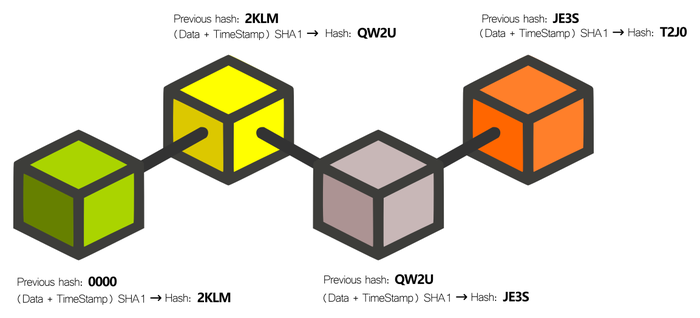
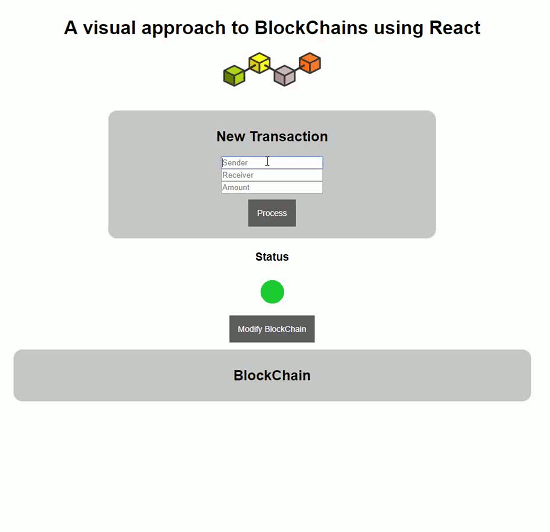

A visual approach to BlockChains using React
-------------------------------------------- 

The first work on a block chain with cryptographic security was described in 1991 by Stuart Haber and W. Scott Stornetta. The first blockchain was conceptualized by Satoshi Nakamoto 2008 for use in bitcoin cryptocurrency.

A block chain is a distributed database. It is made up of block chains that have been designed to avoid modification once a data has been published. This is done by using a reliable time stamp and linking to a previous block. 

It is particularly suitable for storing data in a time-ordered manner and without the possibility of modification. It is an approach with different aspects:

■ Data storage: by replicating the information in the block chain

■ Data transmission: performed through peer networks.

■ Data confirmation: this is achieved through a process of consensus among the participating nodes. 

So basically, a block chain is a linked data structure that grows as a set of nodes or blocks. If you have ever used linked lists we can use it as a way to understand it: a linked list is a type of self-referenced data that contains, as part of its information, a pointer to another type of data of the same type. 

The blockchain is a more complex data structure. Each of these self-referenced data is called a "block" and each of them has an index, a timestamp, a hash of its own, a hash of the previous block and the data it contains. This data can be of any kind. When we refer to cryptocurrency, the data is the details of the transaction, basically the sender, the amount and the recipient. 

The blockchain, thanks to the hashs, which act like fingerprints, is not easy to manipulate.  These hashes are generated only once when the block is created and for this purpose the values of the other attributes of the block are used. If we change, even if only one value, the hash will no longer be valid and the whole block will be invalidated.

Blockchains are not stored on a centralized server. They are distributed throughout the Internet and connected using a peer-to-peer network. When someone joins this network they are given a full copy of it; and when they create a new block, it is sent to all peers and the validity of the string is checked. If everything is correct the new block is connected to the string. 

The project
-----------------

We have developed a visual approach to the subject of Blockchains using React.

You can see it running here: <http://herreriasjose.react.blockchain.s3-website-eu-west-1.amazonaws.com/>